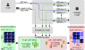

# CheckEmbed

<p align="center">
  
</p>

This is the official implementation of [CheckEmbed: Effective Verification of LLM Solutions to Open-Ended Tasks](https://arxiv.org/abs/2406.02524).

This framework gives you the ability to verify LLM answers, especially for
intricate open-ended tasks such as consolidation, summarization, and extraction
of knowledge. CheckEmbed implements verification by running the LLMs' answers through
an embedding model and comparing the corresponding answer-level embeddings.
This reduction of a complex textual answer to a single embedding facilites a
straightforward, fast, and meaningful verification, while showcasing
significant improvements in accuracy, cost-effectiveness, and runtime
performance compared to existing token-, sentence-, and fact-level schemes such
as BERTScore or SelfCheckGPT.


## Setup Guide

In order to use this framework, you need to have a working installation of Python 3.8 or newer.


### Installing CheckEmbed

Before running either of the following two installation methods, make sure to activate your Python environment (if any) beforehand.
If you are a user and you just want to use `CheckEmbed`, you can install it from source:
```bash
git clone https://github.com/spcl/CheckEmbed.git
cd CheckEmbed
pip install .
python3 -m spacy download "en_core_web_sm"

# If you want to use a CUDA GPU, please install the following environment as well.
pip install ".[cuda]"
```
If you are a developer and you want to modify the code, you can install it in editable mode from source:
```bash
git clone https://github.com/spcl/CheckEmbed.git
cd CheckEmbed
pip install -e .
python3 -m spacy download "en_core_web_sm"

# If you want to use a CUDA GPU, please install the following environment as well.
pip install -e ".[cuda]"
```

### Configuring the Models

In order to use parts of the framework, you need to have access to an LLM and/or an embedding model.
Please follow the instructions in the READMEs of the respective modules to configure the [LLMs](CheckEmbed/language_models/README.md) and [embedding models](CheckEmbed/embedding_models/README.md) of your choice.
Please create a copy of `config_template.json` named `config.json` in the CheckEmbed directory and update its details according to your needs.


## Documentation
The paper gives a high-level overview of the framework and its components.
In order to understand the framework in more detail, you can read the documentation of the individual modules.
Especially the [Scheduler](CheckEmbed/scheduler/scheduler.py) module is important for understanding how to make the most out of the framework
as well as the [Operation](CheckEmbed/operations/README.md) module for the interpretation of the results.


## Examples

The [examples](examples) directory contains several examples of use cases that can be solved using the framework, including the ones presented in the paper.
It is a great starting point for learning how to use the framework to solve real problems.
Each example contains a `README.md` file with instructions on how to run it and play with it.


## Paper Results

You can run the experiments from the paper by following the instructions in the [examples](examples) directory.
However, if you just want to inspect and replot the results, you can use the [paper](paper) directory.


## Citations

If you find this repository valuable, please give it a star!
Got any questions or feedback? Feel free to reach out and open an issue.
Using this in your work? Please reference us using the provided citation:

```bibtex
@misc{besta2024checkembed,
  title = {{CheckEmbed: Effective Verification of LLM Solutions to Open-Ended Tasks}},
  author = {Besta, Maciej and Paleari, Lorenzo and Kubicek, Ales and Nyczyk, Piotr and Gerstenberger, Robert and Iff, Patrick and Lehmann, Tomasz and Niewiadomski, Hubert and Hoefler, Torsten},
  year = 2024,
  month = Jun,
  eprinttype = {arXiv},
  eprint = {2406.02524}
}
```
